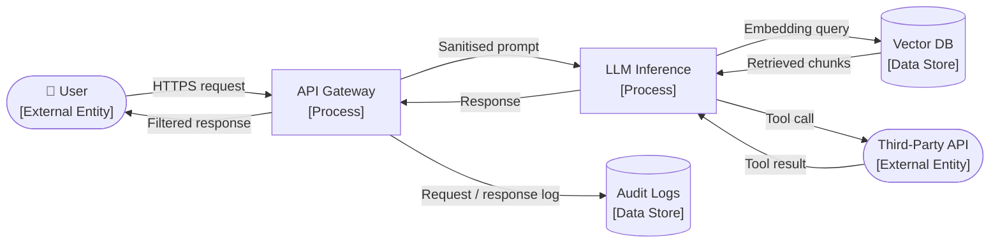
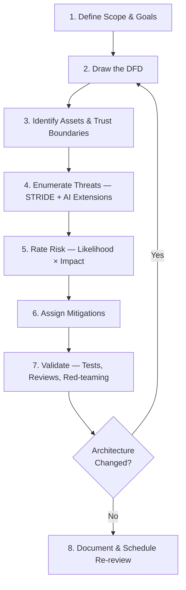

# 00 — Threat Modeling Fundamentals for AI/ML Systems

> **Read this first.** This document gives you every concept and vocabulary item you need to follow — and eventually author — threat model walkthroughs for AI applications.

---

## Table of Contents

1. [Why Threat Model AI Systems?](#1-why-threat-model-ai-systems)
2. [Core Concepts](#2-core-concepts)
   - [Data Flow Diagrams (DFDs)](#21-data-flow-diagrams-dfds)
   - [Trust Boundaries](#22-trust-boundaries)
   - [Assets](#23-assets)
   - [Attacker Profiles](#24-attacker-profiles)
3. [STRIDE Threat Taxonomy](#3-stride-threat-taxonomy)
4. [AI-Specific Threat Extensions](#4-ai-specific-threat-extensions)
5. [The Threat Modeling Process](#5-the-threat-modeling-process)
6. [Prioritisation — Risk Scoring](#6-prioritisation--risk-scoring)
7. [Mitigations Framework](#7-mitigations-framework)
8. [Testing & Monitoring](#8-testing--monitoring)
9. [Walkthrough Template](#9-walkthrough-template)
10. [References](#10-references)

---

## 1 Why Threat Model AI Systems?

Traditional software threat modeling already covers authentication bypass, injection, and data leakage. AI systems introduce an entirely new attack surface:

| Traditional Attack Surface | AI-Specific Extension |
|----------------------------|----------------------|
| Input validation (SQL injection, XSS) | Prompt injection, adversarial inputs |
| Data in transit / at rest | Training data poisoning, model inversion |
| Authentication / authorisation | Model API access, per-tenant isolation |
| Supply chain (packages, libraries) | Pretrained models, dataset provenance |
| Insider threat | Model memorisation, unintended data leakage |
| Availability (DoS) | Sponge attacks, context-window flooding |

> **Key insight:** The model *is* part of the attack surface. You must threat model the model itself, the data used to build it, the inference pipeline, and every integration point.

---

## 2 Core Concepts

### 2.1 Data Flow Diagrams (DFDs)

A DFD is a map of *where data goes* inside and around your system. It uses four primitives:

| Symbol | Name | Meaning |
|--------|------|---------|
| Rectangle | **External Entity** | Something outside your control (user, 3rd-party API) |
| Rounded rectangle / circle | **Process** | A component that transforms data (LLM, API server) |
| Open-ended rectangle | **Data Store** | Persistent storage (vector DB, SQL DB, blob store) |
| Arrow | **Data Flow** | Movement of data between elements |

A **Level-0 DFD** (context diagram) shows the whole system as one process and all external entities.  
A **Level-1 DFD** expands the system into its major processes and data stores.

#### Example Level-1 DFD (generic AI service)



### 2.2 Trust Boundaries

A **trust boundary** is a line in your DFD where data crosses between zones of different privilege or trust. Every crossing is a potential attack vector.

Common boundaries in AI systems:

| Boundary | Description |
|----------|-------------|
| **Internet ↔ DMZ** | User-facing API endpoint |
| **DMZ ↔ Internal network** | Inference cluster, vector DB |
| **Tenant A ↔ Tenant B** | Logical isolation in multi-tenant SaaS |
| **Application ↔ LLM provider** | Third-party API (OpenAI, Anthropic, etc.) |
| **LLM ↔ Tool/Plugin** | Model-initiated external calls |
| **Training environment ↔ Production** | Model artefacts crossing environments |

> **Rule:** Every time a data flow crosses a trust boundary, ask "what happens if an attacker controls this data?"

### 2.3 Assets

An **asset** is anything that has value to the organisation *or* to an attacker.

| Asset Class | AI Examples |
|-------------|-------------|
| **Data** | User queries, training data, retrieved documents, PII |
| **Model** | Weights, hyperparameters, fine-tune checkpoints |
| **Intellectual property** | System prompts, proprietary embeddings, business logic |
| **Infrastructure** | GPU clusters, inference endpoints, vector databases |
| **Reputation / Trust** | Brand, regulatory compliance status |
| **Availability** | SLA uptime, latency guarantees |

### 2.4 Attacker Profiles

| Profile | Motivation | Capability | Example |
|---------|-----------|-----------|---------|
| **Curious user** | Explore limits | Low | Tries unusual prompts |
| **Competitive actor** | Extract IP | Medium | Model extraction queries |
| **Malicious insider** | Sabotage / exfiltrate | High | Poisons training data |
| **Nation-state / APT** | Espionage, disruption | Very high | Supply-chain compromise |
| **Automated scanner** | Opportunistic | Low–medium | Probes for known CVEs |
| **Adversarial researcher** | Demonstrate weakness | Medium–high | Jailbreak discovery |

---

## 3 STRIDE Threat Taxonomy

STRIDE is a mnemonic for six categories of threats. For each data flow or component, ask whether each category applies.

| Letter | Threat | Violated Property | AI Example |
|--------|--------|-------------------|------------|
| **S** | **Spoofing** | Authentication | Impersonating a trusted user/service to the LLM API |
| **T** | **Tampering** | Integrity | Poisoning the vector database with malicious documents |
| **R** | **Repudiation** | Non-repudiation | Denying that a harmful query was sent (no audit log) |
| **I** | **Information Disclosure** | Confidentiality | LLM leaks training data or system prompt in its output |
| **D** | **Denial of Service** | Availability | Sponge inputs that maximise GPU compute per request |
| **E** | **Elevation of Privilege** | Authorisation | Prompt injection causes the agent to call privileged APIs |

### How to Apply STRIDE

For **every data flow arrow** and **every process/data store**, fill in a row:

| Component / Flow | S | T | R | I | D | E | Notes |
|-----------------|---|---|---|---|---|---|-------|
| User → API | ✓ | ✗ | ✓ | ✗ | ✓ | ✗ | Spoofing via stolen JWT; repudiation if no logging |
| API → LLM | ✗ | ✓ | ✗ | ✓ | ✓ | ✓ | Prompt injection (T+E); context leakage (I) |
| … | … | … | … | … | … | … | … |

---

## 4 AI-Specific Threat Extensions

STRIDE was designed for traditional software. AI systems need additional categories:

| Threat | Description | Example |
|--------|-------------|---------|
| **Prompt Injection** | Attacker-controlled input overrides system instructions | Malicious document in RAG corpus instructs model to exfiltrate data |
| **Data Poisoning** | Training or retrieval data corrupted to alter model behaviour | Attacker inserts biased records into fine-tune dataset |
| **Model Extraction / Theft** | Adversary reconstructs a functional copy via queries | Querying the API millions of times to distil a shadow model |
| **Membership Inference** | Determining if a specific record was in training data | Privacy breach for sensitive datasets (medical, legal) |
| **Model Inversion** | Recovering training data from model parameters or outputs | Reconstructing patient images from medical imaging model |
| **Adversarial Inputs** | Crafted inputs that reliably fool the model | Image with imperceptible noise misclassified as benign |
| **Hallucination Exploitation** | Weaponising confident but false model outputs | Fake legal citations, incorrect medical dosages |
| **Indirect Prompt Injection** | Malicious instructions embedded in external data the model reads | Attacker embeds instructions in a webpage the agent browses |
| **Supply-Chain Attack** | Compromised pretrained model weights or training datasets | Backdoored model from public hub activates on trigger phrase |
| **Agent / Tool Misuse** | Autonomous agent calls unintended tools or APIs | Agent deletes files, sends emails without user authorisation |

---

## 5 The Threat Modeling Process



### Step-by-Step Guidance

**Step 1 — Define scope and goals**
- Which system, version, and deployment environment?
- What are the crown-jewel assets?
- Who are the intended users, and who are the adversaries?

**Step 2 — Draw the DFD**
- Start at Level 0 (black box), expand to Level 1.
- Include every external entity, process, data store, and data flow.
- Note technologies (e.g., "OpenAI API", "Pinecone vector DB", "AWS S3").

**Step 3 — Identify assets and trust boundaries**
- Annotate the DFD with trust boundary lines (dashed boxes).
- List assets and classify them: Confidentiality / Integrity / Availability (CIA).

**Step 4 — Enumerate threats**
- Walk through every element and data flow.
- Apply STRIDE + AI-specific extensions.
- Write threat statements: *"An attacker who [action] can [impact] because [reason]."*

**Step 5 — Rate risk**
- Use a simple 3×3 or 5×5 risk matrix.
- Prioritise: High-likelihood + High-impact threats first.

**Step 6 — Assign mitigations**
- For each threat, assign at least one mitigation.
- Categorise: Prevent / Detect / Respond.
- Assign ownership and target date.

**Step 7 — Validate**
- Write specific security tests or fuzzing scenarios.
- Red-team the system (internal or external).
- Perform adversarial ML evaluation where applicable.

**Step 8 — Document and schedule re-review**
- Threat model must be updated when: new features, new integrations, change in data classification, new attacker intelligence.
- Minimum: annual review.

---

## 6 Prioritisation — Risk Scoring

### DREAD (simplified)

| Factor | 1 (Low) | 2 (Medium) | 3 (High) |
|--------|---------|-----------|---------|
| **Damage** | Minimal impact | Significant data or service loss | Catastrophic / existential |
| **Reproducibility** | Hard to reproduce | Reliably reproducible with effort | Trivially reproducible |
| **Exploitability** | Requires deep expertise | Requires some skill | No special skill needed |
| **Affected users** | Single user | Group of users | All users |
| **Discoverability** | Obscure | Known to some | Publicly known / scannable |

**Risk Score** = sum of factors (5–15). Prioritise ≥ 10.

### Simpler 3×3 Matrix

```
             Impact
             Low   Med   High
Likelihood
  High    [  M  ][  H  ][ CRIT ]
  Medium  [  L  ][  M  ][  H  ]
  Low     [  L  ][  L  ][  M  ]
```

---

## 7 Mitigations Framework

For each threat category, a standard set of controls applies:

| STRIDE Category | Primary Controls |
|-----------------|-----------------|
| **Spoofing** | Strong authentication (MFA, mutual TLS), signed JWTs, API key rotation |
| **Tampering** | Input validation, content hashing, signed model artefacts, DB write controls |
| **Repudiation** | Immutable audit logs, structured logging with user/session IDs, SIEM |
| **Info. Disclosure** | Encryption at rest/in transit, output filtering, system prompt protection, PII scrubbing |
| **DoS** | Rate limiting, input length caps, token budgets, load shedding, auto-scaling |
| **EoP** | Least-privilege RBAC, tool call allow-lists, human-in-the-loop for sensitive ops |

| AI-Specific Threat | Primary Controls |
|--------------------|-----------------|
| **Prompt Injection** | Input sanitisation, prompt delimiters, system prompt hardening, output validation |
| **Data Poisoning** | Dataset provenance tracking, anomaly detection on training data, human review |
| **Model Extraction** | Rate limiting, query watermarking, differential privacy in training |
| **Membership Inference** | Differential privacy, output perturbation, aggregation-only APIs |
| **Adversarial Inputs** | Adversarial training, ensemble voting, input pre-processing (smoothing, certifications) |
| **Indirect Injection** | Treat retrieved/external content as untrusted, separate instruction & data channels |
| **Supply Chain** | Model signing, SBOM for ML, trusted registries, hash verification |
| **Agent Misuse** | Tool allow-lists, capability scoping, human approval gates, sandboxed execution |

---

## 8 Testing & Monitoring

### Security Testing Approaches

| Type | When to Use | Tools |
|------|------------|-------|
| **Static analysis** | During development | Bandit (Python), Semgrep, CodeQL |
| **DAST / Fuzzing** | Pre-production | OWASP ZAP, Burp Suite, custom fuzzers |
| **Adversarial ML evaluation** | Model evaluation phase | Foolbox, ART (IBM), TextAttack |
| **Prompt injection testing** | LLM integration | Garak, custom red-team prompts |
| **Red-team exercises** | Pre-launch, annually | Internal or third-party |
| **Penetration testing** | Pre-launch, on change | CREST/OSCP certified testers |

### Monitoring Signals for AI Systems

| Signal | What It Catches |
|--------|----------------|
| Anomalous query rate per user/IP | Model extraction, DoS |
| Unusual token counts (very long inputs) | Sponge attacks, prompt injection |
| Semantic drift in outputs | Model poisoning, drift |
| System-prompt keywords in output | Prompt injection / leakage |
| Failed authentication spike | Credential stuffing, API key brute force |
| Tool-call volume / unusual tool sequences | Agent misuse, privilege escalation |
| Embedding distribution shift | Retrieval corpus poisoning |

---

## 9 Walkthrough Template

When adding a new threat model to this guide, use the following template:

```markdown
# XX — [System Name] Threat Model

## 1. Scenario & Architecture
[Description of the system, its users, purpose, and deployment context.]

## 2. Data Flow Diagram
[Mermaid flowchart — Level-1 DFD with trust boundaries]

## 3. Assets
| Asset | Classification | Owner |
|-------|---------------|-------|
| … | … | … |

## 4. Trust Boundaries
| Boundary | Between |
|----------|---------|
| … | … |

## 5. Attacker Profiles
| Profile | Motivation | Capability |
|---------|-----------|-----------|
| … | … | … |

## 6. STRIDE Threat Enumeration
| ID | Component / Flow | Threat | Category | Likelihood | Impact | Risk |
|----|-----------------|--------|----------|-----------|--------|------|
| T1 | … | … | … | … | … | … |

## 7. Mitigations
| Threat ID | Mitigation | Type | Priority |
|-----------|-----------|------|----------|
| T1 | … | Prevent / Detect / Respond | H/M/L |

## 8. How to Test & Monitor
[Specific test cases and monitoring signals for this system.]

## 9. References
[Links to relevant standards, tools, CVEs, or research papers.]
```

---

## 10 References

| Resource | URL |
|----------|-----|
| OWASP LLM Top 10 | https://owasp.org/www-project-top-10-for-large-language-model-applications/ |
| MITRE ATLAS | https://atlas.mitre.org/ |
| NIST AI RMF | https://www.nist.gov/system/files/documents/2023/01/26/NIST.AI.100-1.pdf |
| Microsoft SDL Threat Modeling | https://learn.microsoft.com/en-us/azure/security/develop/threat-modeling-tool |
| Google SAIF | https://saif.google/ |
| ENISA AI Security Guidelines | https://www.enisa.europa.eu/publications/artificial-intelligence-cybersecurity-challenges |
| IBM Adversarial Robustness Toolbox | https://github.com/Trusted-AI/adversarial-robustness-toolbox |
| Garak (LLM red-teaming) | https://github.com/leondz/garak |
| TextAttack | https://github.com/QData/TextAttack |
| LINDDUN Privacy Threat Modeling | https://linddun.org/ |

---

← [Back to Index](./README.md)
