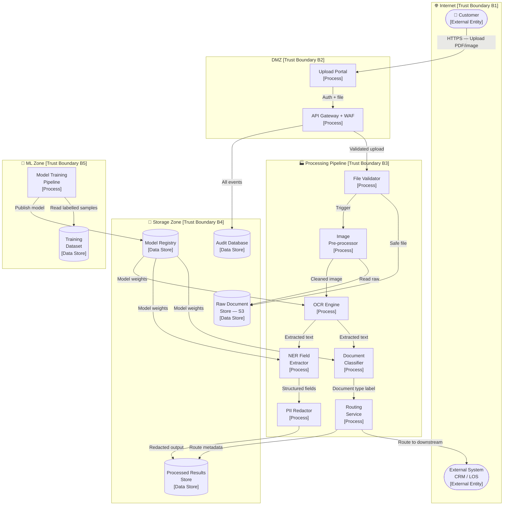
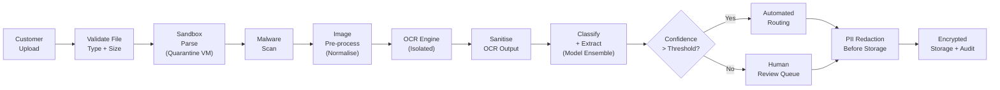

# 03 — Threat Model: Document OCR Processing & Classification Pipeline

> **Architecture:** An automated pipeline that ingests scanned documents, performs OCR, classifies them by type and sensitivity, and routes them for downstream processing.

---

## Table of Contents

1. [Scenario & Architecture](#1-scenario--architecture)
2. [Data Flow Diagram](#2-data-flow-diagram)
3. [Assets](#3-assets)
4. [Trust Boundaries](#4-trust-boundaries)
5. [Attacker Profiles](#5-attacker-profiles)
6. [STRIDE Threat Enumeration](#6-stride-threat-enumeration)
7. [AI-Specific Threats](#7-ai-specific-threats)
8. [Mitigations](#8-mitigations)
9. [How to Test & Monitor](#9-how-to-test--monitor)
10. [References](#10-references)

---

## 1 Scenario & Architecture

### Description

A financial services company processes thousands of scanned documents daily — loan applications, identity documents (passports, driver's licenses), bank statements, tax forms, and contracts. An automated AI pipeline:

1. **Ingests** scanned PDFs and images via a customer-facing upload portal or email.
2. **Pre-processes** images (deskew, denoise, binarisation).
3. **Performs OCR** using a trained model (e.g., Tesseract, Azure Document Intelligence, AWS Textract).
4. **Classifies** the document type (identity doc, financial statement, contract) using a multi-class classifier.
5. **Extracts structured fields** (name, date, amounts) using a Named Entity Recognition (NER) model.
6. **Routes** the structured data to downstream systems (loan origination, CRM, compliance system).
7. **Archives** original images and extracted data in a document management system (DMS).

### Users and Roles

| Role | Access Level |
|------|-------------|
| **Customer** | Upload documents via portal; view processing status |
| **Operations Staff** | Review flagged documents; correct extraction errors |
| **Compliance Officer** | Access audit trails; run regulatory reports |
| **ML Engineer** | Update OCR and classifier models; monitor accuracy |
| **External System** (CRM, LOS) | Receive routed structured data |

### Technology Stack (representative)

- **Upload Portal:** React web app (public internet)
- **API Gateway:** AWS API Gateway + WAF
- **Pre-processing:** OpenCV (AWS Lambda)
- **OCR Engine:** AWS Textract or Azure Document Intelligence
- **Classifier:** Scikit-learn / Transformers (hosted on SageMaker)
- **NER Model:** SpaCy or fine-tuned BERT (SageMaker endpoint)
- **DMS:** AWS S3 with versioning + encryption
- **Routing:** AWS SQS → microservices
- **Audit DB:** PostgreSQL with append-only logging

---

## 2 Data Flow Diagram

---

## 3 Assets

| Asset | Classification | CIA Priority | Owner |
|-------|---------------|--------------|-------|
| Customer documents (passports, bank statements) | Highly Confidential / PII | C > I > A | Customer + Legal |
| Extracted PII (names, SSNs, account numbers) | Highly Confidential / PII | C > I | Compliance |
| OCR model weights | Proprietary IP | C > I | ML Engineering |
| Classifier & NER model weights | Proprietary IP | C > I | ML Engineering |
| Training dataset (labelled documents) | Highly Confidential | C > I | ML Engineering |
| Processed results store | Confidential | C > I | Operations |
| Audit database | Sensitive | I > C > A | Compliance |
| System uptime / processing SLA | Operational | A | DevOps |
| API keys for cloud OCR services | Secret | C | Security |

---

## 4 Trust Boundaries

| ID | Boundary | Between |
|----|----------|---------|
| **B1** | Internet perimeter | Customer / external systems ↔ DMZ |
| **B2** | DMZ | Public-facing portal ↔ internal pipeline |
| **B3** | Processing pipeline | DMZ ↔ internal ML and routing services |
| **B4** | Storage zone | Processing pipeline ↔ persistent data stores |
| **B5** | ML zone | Production inference ↔ model training environment |
| **B6** | Downstream systems | Internal pipeline ↔ external CRM/LOS |

---

## 5 Attacker Profiles

| Profile | Motivation | Capability | Entry Points |
|---------|-----------|-----------|--------------|
| **Malicious customer** | Bypass identity verification; extract others' data | Low–Medium | Upload portal |
| **Competitor** | Steal proprietary OCR/classifier models | Medium | API, model registry |
| **Financial fraudster** | Submit forged documents that OCR misclassifies | Medium | Upload portal (crafted inputs) |
| **Ransomware actor** | Encrypt document store, disrupt processing | High | Phishing → internal network access |
| **Nation-state / APT** | Mass PII exfiltration | Very High | Supply chain, cloud provider |
| **Insider threat** | Sell customer PII; sabotage models | High | Direct storage and model access |

---

## 6 STRIDE Threat Enumeration

| ID | Component / Data Flow | Threat | Category | Likelihood | Impact | Risk |
|----|-----------------------|--------|----------|-----------|--------|------|
| T01 | Customer → Upload Portal | Customer submits forged identity document to pass KYC | **Spoofing** | High | High | **Critical** |
| T02 | FileValidator | Attacker submits malformed PDF (e.g., PolyglotPDF) to exploit file parser | **Tampering** | Medium | High | **High** |
| T03 | Training Dataset | Insider labels documents incorrectly to degrade classifier accuracy | **Tampering** | Low | High | **Medium** |
| T04 | Audit Database | Operations staff views another customer's document; no audit trail | **Repudiation** | Low | High | **Medium** |
| T05 | Processed Results Store | Attacker gains S3 access and downloads extracted PII in bulk | **Info. Disclosure** | Medium | Very High | **Critical** |
| T06 | OCR Engine output | OCR text contains injected instructions processed by downstream LLM | **Tampering** | Medium | High | **High** |
| T07 | Model Registry | Model weights replaced with backdoored version | **Tampering** | Low | Very High | **High** |
| T08 | Processing Pipeline | Flood pipeline with large files to exhaust Lambda concurrency | **DoS** | Medium | Medium | **Medium** |
| T09 | Raw Document Store | Old documents not purged; exceed retention policy; privacy liability | **Info. Disclosure** | Medium | High | **High** |
| T10 | API Gateway | Attacker enumerates document processing status of other customers | **Info. Disclosure** | Low | Medium | **Low** |
| T11 | External System (CRM/LOS) | Attacker compromises external system to pull all routed data | **EoP** | Low | Very High | **High** |

---

## 7 AI-Specific Threats

| ID | Threat | Description | Risk |
|----|--------|-------------|------|
| AI-01 | **Adversarial Document Attack** | Attacker crafts a document with imperceptible perturbations that cause OCR to misread critical fields (e.g., loan amount "100,000" → "1,000,000") | **Critical** |
| AI-02 | **Classifier Evasion** | Malicious document designed to be misclassified (e.g., a counterfeit identity document classified as "other" to bypass verification) | **High** |
| AI-03 | **OCR Prompt Injection** | Document contains hidden text (white-on-white, micro-font) that, when extracted, injects instructions into downstream LLM processing | **High** |
| AI-04 | **Model Inversion on NER** | Attacker probes NER endpoint repeatedly to reconstruct patterns in training PII data | **Medium** |
| AI-05 | **Data Poisoning of Training Set** | Fraudster submits many carefully crafted fraudulent documents that get labelled as legitimate, poisoning retraining cycles | **High** |
| AI-06 | **Membership Inference** | Attacker determines whether a specific person's document is in the training set (PII privacy violation) | **Medium** |
| AI-07 | **Confidence Score Exploitation** | Attacker iterates on document submission until classifier confidence on "legitimate" label exceeds threshold, passing automated review | **High** |

---

## 8 Mitigations

| Threat ID | Mitigation | Type | Priority |
|-----------|-----------|------|---------|
| T01, AI-02, AI-07 | **Multi-factor document verification**: liveness check for ID docs; cross-reference with external identity databases (e.g., eIDAS, AAMVA); human review for low-confidence classifications | Prevent | Critical |
| T02 | **Strict file validation**: allow-list MIME types; PDF sandboxed parsing (quarantine VM); file size limits; strip macros and scripts | Prevent | High |
| T03, AI-05 | **Training data governance**: human review of all labelled samples before training; label provenance tracking; statistical anomaly detection on label distributions | Prevent | High |
| T04 | **Row-level access control** on processed results store; every access logged with user + document ID; SIEM alerts on bulk access | Prevent + Detect | High |
| T05 | **Encryption at rest** (AES-256) and in transit (TLS 1.3); S3 bucket policies with least-privilege; VPC endpoint for S3 (no public internet route) | Prevent | Critical |
| T06, AI-03 | **Treat OCR output as untrusted data**; sanitise before passing to any downstream LLM; strip control characters; use structured output parsers | Prevent | High |
| T07 | **Signed model artefacts** (Sigstore / MLflow Model Registry hash); deployment pipeline verifies signature before loading; WORM storage for model registry | Prevent | High |
| T08 | **File size cap** (e.g., 25 MB); concurrency limits per customer; async processing queue with back-pressure; Lambda reserved concurrency | Prevent | Medium |
| T09 | **Automated data retention enforcement**: delete raw images after processing + 30 days unless legally required; lifecycle policies on S3 | Prevent | High |
| T11 | **Mutual TLS + signed payloads** to downstream systems; minimal data sharing (need-to-know); downstream system security review | Prevent | High |
| AI-01, AI-02 | **Adversarial robustness**: input smoothing/pre-processing (JPEG compression, median filter) before OCR; ensemble OCR systems; confidence thresholding with human escalation | Prevent + Detect | High |
| AI-04, AI-06 | **Differential privacy** in NER training; rate limit NER API per user/IP; output perturbation on confidence scores | Prevent | Medium |

### Document Processing Security Architecture

---

## 9 How to Test & Monitor

### Security Tests

| Test | What It Validates | How |
|------|------------------|-----|
| **Adversarial document battery** | OCR is robust to visual perturbations | Use [TextAttack](https://github.com/QData/TextAttack) and custom adversarial image generator; assert critical fields extracted correctly |
| **PDF parser fuzzing** | File validator rejects malformed PDFs | Mutate valid PDFs with [pdf-fuzz](https://github.com/google/oss-fuzz) seed corpus; assert no crashes or unexpected output |
| **OCR injection test** | Hidden text does not propagate as instructions | Submit PDF with white-on-white text containing injection payload; assert it does not reach downstream LLM or system |
| **Bulk access test** | Operations staff cannot bulk-download all documents | Attempt programmatic enumeration of document IDs; assert 403 after threshold |
| **S3 bucket policy audit** | No public access to document store | Run AWS Config + Prowler; assert 0 public buckets |
| **Model signature test** | Deployment fails with unsigned/modified model | Replace model hash; assert pipeline rejects deployment |
| **Data retention compliance** | Old documents purged per policy | Inject test document with creation date 60 days ago; assert purge job removes it |

### Monitoring Signals

| Signal | Threshold | Possible Attack |
|--------|----------|----------------|
| Failed classification confidence < 0.7 spike | > 10% of hourly volume | Adversarial document attack |
| Single customer submits > 20 documents/hour | Alert | Iterative classifier evasion |
| OCR output contains instruction-like strings | Flag all | OCR injection attempt |
| Model endpoint error rate > 2% | Alert | Adversarial input stress / DoS |
| S3 GetObject calls from new IAM role | Alert | Data exfiltration attempt |
| Training data label distribution shift > 15% | Alert | Data poisoning attempt |
| Downstream system connection from new IP | Alert | Compromised downstream system |
| Document deletion event outside retention job | Alert | Evidence tampering |

---

## 10 References

| Resource | URL |
|----------|-----|
| OWASP Top 10 — A05: Security Misconfiguration (file upload) | https://owasp.org/Top10/A05_2021-Security_Misconfiguration/ |
| Adversarial Robustness Toolbox (IBM) | https://github.com/Trusted-AI/adversarial-robustness-toolbox |
| NIST SP 800-188 — De-Identification of Government Data | https://csrc.nist.gov/publications/detail/sp/800-188/final |
| GDPR Article 25 — Data Protection by Design | https://gdpr-info.eu/art-25-gdpr/ |
| TextAttack — NLP Adversarial Evaluation | https://github.com/QData/TextAttack |
| Polyglot PDF Research | https://github.com/corkami/docs/blob/master/PDF/PDF.md |
| AWS Textract Security Best Practices | https://docs.aws.amazon.com/textract/latest/dg/security.html |
| MITRE ATLAS — Craft Adversarial Data | https://atlas.mitre.org/techniques/AML.T0043 |

---

← [Back to Index](./README.md) | Previous: [02 — Code Assistant](./02-code-assistant.md) | Next: [04 — AI SaaS Platform →](./04-ai-saas-platform.md)
