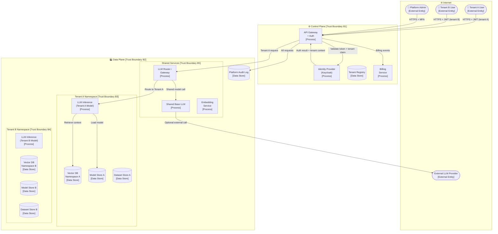
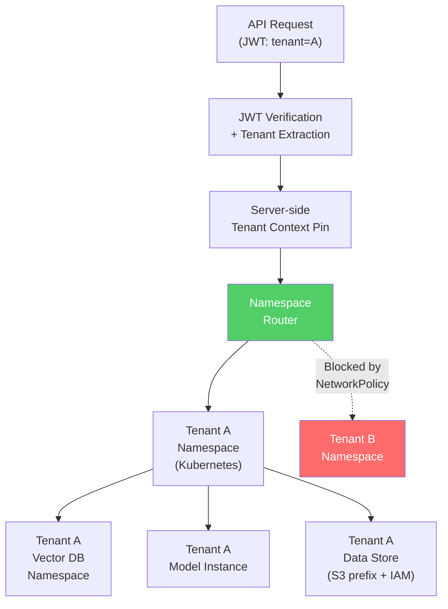

# 04 — Threat Model: Multi-Tenant AI SaaS Platform

> **Architecture:** A cloud-hosted AI SaaS platform that serves multiple customer organisations (tenants), each with their own data, models, and users — all running on shared infrastructure.

---

## Table of Contents

1. [Scenario & Architecture](#1-scenario--architecture)
2. [Data Flow Diagram](#2-data-flow-diagram)
3. [Assets](#3-assets)
4. [Trust Boundaries](#4-trust-boundaries)
5. [Attacker Profiles](#5-attacker-profiles)
6. [STRIDE Threat Enumeration](#6-stride-threat-enumeration)
7. [AI-Specific Threats](#7-ai-specific-threats)
8. [Mitigations](#8-mitigations)
9. [How to Test & Monitor](#9-how-to-test--monitor)
10. [References](#10-references)

---

## 1 Scenario & Architecture

### Description

An AI SaaS company offers a **natural language analytics platform** to multiple enterprise customers. Each tenant (customer organisation) can:

- Upload their own datasets and documents for analysis.
- Fine-tune or customise a base LLM for their use case.
- Deploy their own models as private inference endpoints.
- Invite their own users with role-based access.
- Query shared platform capabilities (base models, embeddings).

The platform is deployed on shared Kubernetes infrastructure with logical (not physical) tenant isolation. A control plane manages tenant provisioning, billing, and configuration. A data plane handles inference, storage, and retrieval per tenant.

### Multi-Tenancy Model

```
Platform
├── Tenant A (Acme Corp)
│   ├── Users: alice, bob
│   ├── Private dataset: acme-docs
│   ├── Fine-tuned model: acme-llm-v2
│   └── Vector DB namespace: acme-ns
├── Tenant B (Globex Inc)
│   ├── Users: carol, dave
│   ├── Private dataset: globex-docs
│   ├── Fine-tuned model: globex-llm-v1
│   └── Vector DB namespace: globex-ns
└── Shared
    ├── Base LLM (GPT-4o / Claude 3)
    ├── Shared embedding service
    └── Platform admin
```

### Technology Stack (representative)

- **Control Plane:** Kubernetes + Helm; PostgreSQL (tenant metadata); Keycloak (IdP)
- **Data Plane:** Isolated namespaces in Kubernetes; Istio service mesh; per-tenant secrets in Vault
- **Vector DB:** Shared Weaviate/Qdrant with tenant namespacing; or per-tenant Pinecone index
- **Model Storage:** Per-tenant S3 prefix with IAM boundaries; MLflow per-tenant experiment
- **LLM Gateway:** Internal LLM router (selects tenant model vs. shared model)
- **Billing / API Management:** Kong or AWS API Gateway with tenant API keys
- **Observability:** Grafana + Loki with tenant-scoped dashboards

---

## 2 Data Flow Diagram



---

## 3 Assets

| Asset | Classification | CIA Priority | Owner |
|-------|---------------|--------------|-------|
| Tenant A's proprietary dataset | Highly Confidential | C > I | Tenant A |
| Tenant B's fine-tuned model weights | Highly Confidential / IP | C > I | Tenant B |
| Cross-tenant authentication tokens / JWTs | Secret | C | Platform Security |
| Tenant metadata and billing information | Confidential | C > I | Platform |
| Shared base LLM weights / configuration | Proprietary | I > C | Platform |
| Platform admin credentials | Critical Secret | C > I | Platform Security |
| Platform control-plane database | Critical | C > I > A | Platform |
| Per-tenant vector DB namespaces | Highly Confidential | C > I | Tenants |
| Platform API keys (per tenant) | Secret | C | Platform Security |
| Audit logs (cross-tenant) | Sensitive | I > C > A | Platform Security |

---

## 4 Trust Boundaries

| ID | Boundary | Between |
|----|----------|---------|
| **B1** | Control plane | Internet ↔ platform APIs |
| **B2** | Data plane perimeter | Control plane ↔ tenant workloads |
| **B3** | Tenant A namespace | Shared data plane ↔ Tenant A resources |
| **B4** | Tenant B namespace | Shared data plane ↔ Tenant B resources |
| **B5** | Shared services | Tenant namespaces ↔ shared LLM/embedding |
| **B6** | External LLM provider | Platform ↔ third-party AI API |
| **B7** | Admin zone | Tenant users ↔ platform admin functions |

---

## 5 Attacker Profiles

| Profile | Motivation | Capability | Entry Points |
|---------|-----------|-----------|--------------|
| **Tenant user (cross-tenant)** | Access competitor's data or model | Low–Medium | API manipulation, JWT tampering |
| **Compromised tenant admin** | Exfiltrate all tenant data; disrupt platform | High | Tenant admin API |
| **Platform-level attacker** | Access all tenants' data simultaneously | Very High | Control plane, Kubernetes cluster |
| **Competitor (industrial espionage)** | Steal another tenant's fine-tuned model | Medium | API probing, model extraction |
| **Ransomware actor** | Encrypt platform data stores | High | Phishing → privileged access |
| **Regulatory adversary** | Demonstrate compliance failure | Medium | Crafted requests that cross boundaries |
| **Nation-state** | Mass data exfiltration from all tenants | Very High | Supply chain, cloud provider |

---

## 6 STRIDE Threat Enumeration

| ID | Component / Data Flow | Threat | Category | Likelihood | Impact | Risk |
|----|-----------------------|--------|----------|-----------|--------|------|
| T01 | API Gateway (JWT validation) | Attacker forges or replays JWT with modified tenant claim to access another tenant's data | **Spoofing** | Medium | Very High | **Critical** |
| T02 | Vector DB namespace routing | Bug in namespace routing sends Tenant A's query to Tenant B's vector store | **Info. Disclosure** | Low | Very High | **High** |
| T03 | Shared LLM context window | Tenant A's conversation context leaks into Tenant B's response via shared KV cache | **Info. Disclosure** | Low | Very High | **High** |
| T04 | Tenant fine-tune pipeline | Tenant A's training data leaks into shared base model updates | **Info. Disclosure** | Low | High | **Medium** |
| T05 | Audit logs | Platform-wide logs expose Tenant A's query patterns to Tenant B or platform staff | **Info. Disclosure** | Medium | High | **High** |
| T06 | Model Store A | Tenant B compromises S3 bucket ACL misconfiguration and downloads Tenant A's model | **Info. Disclosure** | Low | Very High | **High** |
| T07 | API Gateway | Single tenant floods API with requests, degrading service for all tenants | **DoS** | Medium | High | **High** |
| T08 | Control Plane DB | Attacker gains access to tenant registry; can impersonate any tenant | **EoP** | Low | Critical | **Critical** |
| T09 | Kubernetes (shared infrastructure) | Container escape from one tenant's pod leads to access to another tenant's secrets | **EoP** | Low | Critical | **Critical** |
| T10 | LLM Router | Misconfigured routing sends premium tenant's requests to lower-quality model | **Tampering** | Low | Medium | **Low** |
| T11 | Billing Service | Tenant manipulates request metadata to underreport token usage | **Tampering** | Low | Medium | **Low** |

---

## 7 AI-Specific Threats

| ID | Threat | Description | Risk |
|----|--------|-------------|------|
| AI-01 | **Cross-Tenant Prompt Injection** | Tenant A user crafts input that, via the shared LLM, extracts data belonging to Tenant B | **Critical** |
| AI-02 | **Model Extraction across Tenants** | Attacker uses one tenant's account to extract the fine-tuned model of another tenant via API | **High** |
| AI-03 | **Training Data Contamination** | Tenant A's data leaks into Tenant B's fine-tune job via shared training infrastructure | **High** |
| AI-04 | **Shared Model Cache Poisoning** | Attacker crafts inputs that cause the shared KV cache to be poisoned, affecting all tenants | **Medium** |
| AI-05 | **Membership Inference across Tenants** | Attacker probes the shared embedding service to determine if Tenant B has specific documents | **Medium** |
| AI-06 | **Prompt Leakage from System Prompts** | Tenant A's custom system prompt (containing business logic) leaked via model output to Tenant B | **High** |
| AI-07 | **Adversarial Input Amplification** | One tenant's adversarial input breaks shared pre/post-processing, affecting all tenants | **Medium** |

---

## 8 Mitigations

| Threat ID | Mitigation | Type | Priority |
|-----------|-----------|------|---------|
| T01 | **Signed, short-lived JWTs** with `tenant_id` claim; server-side tenant context pinning (never trust client-provided tenant ID for data access); re-verify tenant on every data plane call | Prevent | Critical |
| T02, T03, AI-01 | **Physical isolation for sensitive tenants**: dedicated model instances; per-tenant KV cache; namespace-level network policies in Kubernetes (Istio auth policies) | Prevent | Critical |
| T03 | **Flush KV cache between tenant requests** on shared instances; or use per-tenant inference pods | Prevent | High |
| T04, AI-03 | **Strict tenant data boundary in training**: isolated training jobs with tenant IAM; no cross-tenant data sharing in any pipeline stage | Prevent | High |
| T05 | **Per-tenant log partitioning**: separate log streams with tenant-scoped access; platform staff access requires break-glass + approval | Prevent | High |
| T06 | **S3 bucket policy with condition keys** (`aws:PrincipalTag/TenantId`); every object tagged with tenant ID; deny cross-tenant GetObject | Prevent | High |
| T07 | **Per-tenant token bucket rate limiting**; fair-queuing between tenants; auto-scaling with tenant-level resource quotas | Prevent | High |
| T08 | **Privileged access workstation (PAW)** for control plane ops; MFA + hardware key; control plane behind VPN + IP allowlist; regular access review | Prevent | Critical |
| T09 | **Container security hardening**: read-only root filesystem; no privileged containers; seccomp profiles; Falco for runtime anomaly detection; gVisor/Kata for strong isolation | Prevent | Critical |
| AI-06 | **System prompt stored server-side** (never sent as user-visible message); output filter blocks instruction-like patterns from leaking | Prevent | High |
| AI-02 | **Per-tenant model endpoint access control**: model serving API requires tenant auth token matching model owner; rate limit inference API | Prevent | High |
| AI-04 | **Input sanitisation pipeline per tenant**; shared pre-processor runs in isolated process; output validation before returning to any tenant | Prevent | Medium |

### Tenant Isolation Architecture



---

## 9 How to Test & Monitor

### Security Tests

| Test | What It Validates | How |
|------|------------------|-----|
| **Cross-tenant access test** | Tenant A cannot read Tenant B's data | Using Tenant A credentials, attempt to request Tenant B's vector namespace, model, and dataset; assert 403 |
| **JWT claim tampering test** | Modified tenant claim is rejected | Modify JWT `tenant_id` field; re-sign with wrong key; assert rejection at all data plane layers |
| **Container escape test** | Shared infrastructure is isolated | Run CIS Kubernetes Benchmark (kube-bench); run Falco; attempt namespace-to-namespace cross-talk |
| **KV cache isolation test** | Conversation context does not leak | Send unique sentinel phrase as Tenant A; immediately query as Tenant B; assert phrase not in response |
| **Rate limit per-tenant test** | One tenant's DoS doesn't affect others | Max out Tenant A quota; assert Tenant B requests unaffected |
| **Model access control test** | Tenant A cannot call Tenant B's model | Using Tenant A token, attempt inference on Tenant B model endpoint; assert 403 |
| **Audit log scoping test** | Platform staff cannot see raw query content without break-glass | Verify log entries are tenant-scoped; verify break-glass procedure works |

### Monitoring Signals

| Signal | Threshold | Possible Attack |
|--------|----------|----------------|
| Cross-namespace access denied events | Any | Cross-tenant access attempt |
| JWT with unexpected `tenant_id` | Any | JWT forgery |
| Token usage spike for single tenant | > 10× baseline | DoS or data extraction |
| Container process spawned with root privileges | Any | Container escape attempt |
| S3 cross-tenant GetObject attempt | Any | Direct data exfiltration |
| Model inference requests from non-owning tenant | Any | Cross-tenant model access |
| KV cache size anomaly | > 3× baseline per request | Cache poisoning attempt |
| Control plane DB query volume spike | > 5× baseline | Reconnaissance / bulk data access |

---

## 10 References

| Resource | URL |
|----------|-----|
| OWASP Top 10 — A01: Broken Access Control | https://owasp.org/Top10/A01_2021-Broken_Access_Control/ |
| Kubernetes Security Hardening Guide (NSA/CISA) | https://media.defense.gov/2022/Aug/29/2003066362/-1/-1/0/CTR_KUBERNETES_HARDENING_GUIDANCE_1.2_20220829.PDF |
| Istio Security Architecture | https://istio.io/latest/docs/concepts/security/ |
| MITRE ATLAS — Multi-Tenant Model Attacks | https://atlas.mitre.org/ |
| AWS IAM Attribute-Based Access Control | https://docs.aws.amazon.com/IAM/latest/UserGuide/introduction_attribute-based-access-control.html |
| Falco Runtime Security | https://falco.org/ |
| gVisor (Sandbox Container Runtime) | https://gvisor.dev/ |
| Cloud Security Alliance — AI Tenant Isolation | https://cloudsecurityalliance.org/ |

---

← [Back to Index](./README.md) | Previous: [03 — Document OCR Pipeline](./03-document-ocr-pipeline.md) | Next: [05 — LLM Customer Service Agent →](./05-llm-customer-service-agent.md)
